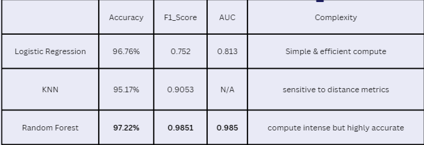
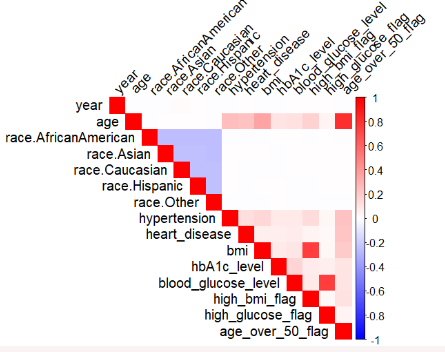

# Diabetes Prediction and Analysis Using Machine Learning

## Overview
This project focuses on predicting diabetes using various machine learning models, including Logistic Regression, K-Nearest Neighbors (KNN), and Random Forest. The analysis is supported by descriptive statistics, performance evaluation metrics, and visualizations to interpret the results effectively.

## Project Objectives
- Predict diabetes based on clinical data (e.g., BMI, HbA1c levels, blood glucose).
- Evaluate model performance using metrics like Accuracy, F1 Score, and AUC.
- Identify key predictors and geographical trends for diabetes incidence.
- Provide actionable insights for early intervention and improved healthcare strategies.

---

## Features
- **Models Used**:
  - Logistic Regression
  - K-Nearest Neighbors (KNN)
  - Random Forest
- **Metrics**:
  - Accuracy, F1 Score, AUC, and Complexity
- **Visualizations**:
  - Performance Comparison
  - Key Predictors
  - Descriptive Trends

---

## Results Summary
### 1. Performance Comparison
- **Logistic Regression**: 
  - Accuracy: 96.76%
  - F1 Score: 0.752
  - AUC: 0.813
- **K-Nearest Neighbors (KNN)**:
  - Accuracy: 95.17%
  - F1 Score: 0.905
- **Random Forest**: 
  - Accuracy: **97.22%**
  - F1 Score: **0.985**
  - AUC: **0.985**

Random Forest outperformed Logistic Regression and KNN with the highest accuracy, F1 Score, and AUC values, making it the most effective model for diabetes prediction.



### 2. Descriptive Analysis
- **Geographical Trends**:
  - Delaware reported the highest diabetes cases, while Wisconsin had the lowest.
- **Key Predictors**:
  - BMI, HbA1c levels, and blood glucose were the most significant features.
- Minimal correlation was observed for race-related variables.



---

## Conclusion
- Random Forest demonstrated superior performance for diabetes prediction.
- BMI, HbA1c levels, and blood glucose are crucial predictors.
- Predictive modeling can prioritize high-risk locations and individuals, enabling proactive healthcare interventions.

---

## Getting Started

### Prerequisites
- **Languages**: R
- **Packages Required**:
  - `caret`, `randomForest`, `e1071`, `ggplot2`

### Installation
1. Clone this repository:
   ```bash
   git clone https://github.com/vickythatguy/diabetesprediction.git


## Files
- **Descriptive Analysis.R**: Code for data exploration and descriptive statistics.
- **Predictive Analysis.R**: Code for implementing and evaluating Logistic Regression, KNN, and Random Forest models.

## Running the Code
1. **Download the dataset** from Kaggle: [Diabetes Clinical Dataset](https://www.kaggle.com/datasets/priyamchoksi/100000-diabetes-clinical-dataset).
2. **Place the dataset** in the appropriate directory.
3. **Run the R scripts sequentially**:
   - Start with `Descriptive Analysis.R` for data exploration and descriptive statistics.
   - Follow with `Predictive Analysis.R` for modeling and evaluation.

